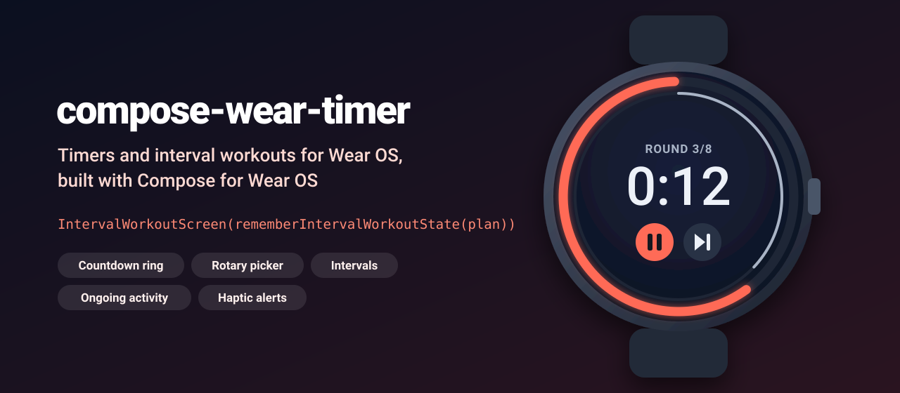
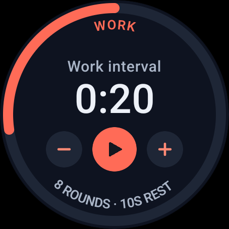
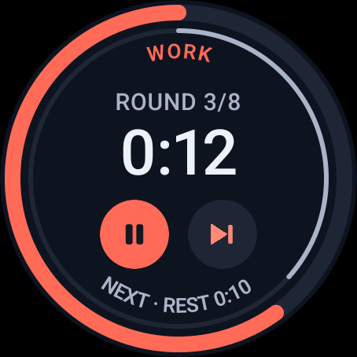
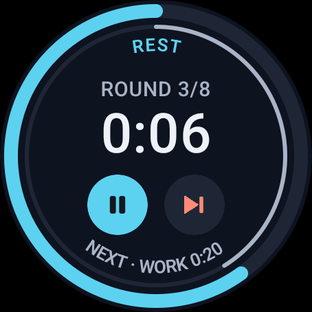
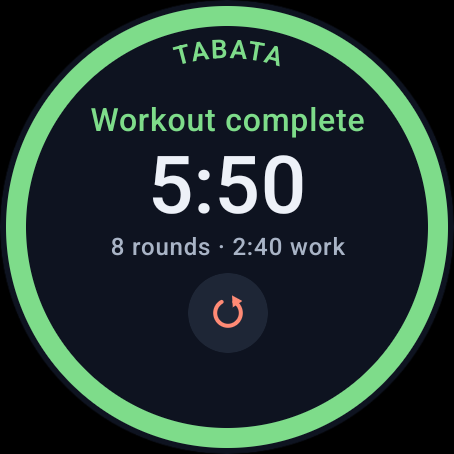

<p align="center">
  
</p>

<p align="center">
  <a href="https://github.com/halilozel1903/compose-wear-timer/actions/workflows/ci.yml"></a>
  <a href="https://jitpack.io/#halilozel1903/compose-wear-timer"></a>
  
  
  
  
  <a href="LICENSE"></a>
</p>

**compose-wear-timer** brings timers and interval workouts to Wear OS, built on Compose for Wear OS and its Material 3 library: a countdown ring for round screens with phase colors and curved labels, a duration picker driven by the crown, a complete interval workout screen (phase, round 3/8, time, pause and skip), haptic alerts for 3-2-1 and phase changes, and an Ongoing Activity helper so the workout keeps counting on the watch face while your foreground service runs. The timing logic (a countdown state machine on an injected clock, workout plans, alerts, formatting and rotary steps) lives in a plain Kotlin module with unit tests.

```kotlin
val haptics = rememberWearHaptics()
val workout = rememberIntervalWorkoutState(WorkoutPlan.tabata(), onAlert = { haptics.play(it) })

AppScaffold {
    ScreenScaffold(timeText = {}) {
        IntervalWorkoutScreen(workout)   // WORK · ROUND 3/8 · 0:12 · pause and skip · NEXT REST 0:10
    }
}
```

## Screenshots

Captured from the sample app, a small Tabata workout app, on a Wear OS emulator (large round, 454 x 454) by CI.

| Duration picker | Work phase | Rest phase | Done |
| :---: | :---: | :---: | :---: |
|  |  |  |  |

## Why

Every Wear OS workout app ends up writing the same timer: a countdown that survives pauses, rotation and process death without drifting, a plan of warm-up, work and rest rounds and cool-down, a ring that fits a round screen, a picker that feels right under the crown, buzzes at 3-2-1 and on every phase change that are delivered exactly once, and a foreground service with an Ongoing Activity so the timer keeps going when the screen turns off. compose-wear-timer packs those parts into small components and keeps the logic in `compose-wear-timer-core`, a pure Kotlin module whose state machines never read the real time: every call takes the time from an injected clock, so tests run instantly with a `ManualClock`.

## Features

- **`rememberWearTimerState(durationMillis)`**: a single countdown with start, pause, toggle, reset, `setDuration` and `addTime` (+1 min). It ticks while running, survives configuration changes and process death (`SystemClock.elapsedRealtime` based), and calls `onAlert` for 3-2-1 and the end.
- **`rememberIntervalWorkoutState(plan)`**: an interval workout with the current phase, round, phase and total remaining time and progress in `snapshot`, plus `skipPhase()`, `previousPhase()`, `restart()` and `seekTo()`.
- **`CountdownRing`**: a ring along the bezel that shrinks back to 12 o'clock as time runs out, in the phase color, with a thin inner ring for the whole workout, a curved label on top and an upright curved label at the bottom.
- **`DurationPicker`**: picks a duration with the crown or rotating bezel (`onRotaryScrollEvent`, focus requested for you) or the - and + buttons. Steps grow with the value (5 s, 15 s, 30 s, 1 min, 5 min), each step ticks the haptics, and there is a slot for a start button.
- **`IntervalWorkoutScreen`**: the complete workout screen: phase name, `ROUND 3/8`, time, pause/resume and skip, the next phase on the bottom bezel and a summary when it is done. A stateless overload takes a `WorkoutSnapshot` for previews.
- **`WearHaptics`**: plays alerts on the vibration motor with distinct patterns: a soft tick for 3-2-1, two strong pulses when work starts, a long soft pulse for rest, three long pulses at the end.
- **`OngoingTimer`**: builds the foreground notification as a Wear OS Ongoing Activity whose status counts down the phase on the watch face with no work from your app (`Status.TimerPart`), and updates it on phase changes and pauses.
- **Alerts exactly once**: `AlertTracker` reports every tick and phase change once however often you poll; skipping a phase reports the phase change but none of the skipped ticks, and only the most important alert of a backlog is played.
- **Pure Kotlin core**: `CountdownTimer`, `IntervalWorkout`, `WorkoutPlan`, `WorkoutController`, `TimerController`, `TimerAlerts`, `HapticPatterns`, `TimeFormat` and `DurationStepper` run on any JVM.

## Installation

Add JitPack to `settings.gradle.kts`:

```kotlin
dependencyResolutionManagement {
    repositories {
        google()
        mavenCentral()
        maven("https://jitpack.io")
    }
}
```

Then the dependency:

```kotlin
dependencies {
    implementation("com.github.halilozel1903.compose-wear-timer:compose-wear-timer:1.0.0")
    // Pure Kotlin timer, workout plan, alert and formatting logic only (for JVM/KMP modules):
    // implementation("com.github.halilozel1903.compose-wear-timer:compose-wear-timer-core:1.0.0")
}
```

The library brings `androidx.wear.compose:compose-material3` and `compose-foundation` 1.6.1 and `androidx.wear:wear-ongoing` 1.0.0 as `api` dependencies, adds the `VIBRATE` permission and needs `minSdk` 30 (Wear OS 3). Your app's manifest should declare it is a watch app:

```xml
<uses-feature android:name="android.hardware.type.watch" />

<application android:theme="@android:style/Theme.DeviceDefault" ...>
    <meta-data
        android:name="com.google.android.wearable.standalone"
        android:value="true" />
    ...
</application>
```

> The build is also set up for Maven Central (`io.github.halilozel1903:compose-wear-timer`) via the vanniktech publish plugin.

## Usage

Wrap your app in the Wear Material 3 theme and `AppScaffold`, and each screen in a `ScreenScaffold`. Pass `timeText = {}` on timer screens: the ring takes the edge of the screen.

```kotlin
setContent {
    MaterialTheme(colorScheme = myColors) {
        AppScaffold {
            ScreenScaffold(timeText = {}) { WorkoutScreen() }
        }
    }
}
```

**Interval workout**

```kotlin
val plan = WorkoutPlan.intervals(
    name = "Tabata",
    workMillis = 20_000,
    restMillis = 10_000,
    rounds = 8,
    warmUpMillis = 60_000,
    coolDownMillis = 60_000,
)
val haptics = rememberWearHaptics()
val workout = rememberIntervalWorkoutState(plan, onAlert = { haptics.play(it) })

LaunchedEffect(Unit) { workout.start() }
IntervalWorkoutScreen(
    state = workout,
    colors = WearTimerDefaults.phaseColors(work = Color(0xFFFF6B57), rest = Color(0xFF5CD2F0)),
    labels = IntervalWorkoutLabels(round = "RUNDE", next = "WEITER"),   // translate the texts
)

// Or build your own screen from the snapshot:
val snapshot = workout.snapshot
snapshot.phase.kind              // PhaseKind.Work
snapshot.round                   // 3
snapshot.totalRounds             // 8
snapshot.phaseRemainingMillis    // 12_000
snapshot.totalProgress           // 0.37
TimeFormat.countdown(snapshot.phaseRemainingMillis)   // "0:12"
```

**Countdown ring and a single timer**

```kotlin
val timer = rememberWearTimerState(durationMillis = 90_000, onAlert = { haptics.play(it) })

CountdownRing(timer, label = "PLANK", bottomLabel = "TAP TO START")
Button(onClick = timer::toggle) { Text(if (timer.isRunning) "Pause" else "Start") }

// Or fully custom:
CountdownRing(
    remainingFraction = timer.remainingFraction,
    color = MaterialTheme.colorScheme.tertiary,
    label = "TEA",
) {
    TimerText(timer.remainingMillis)   // "1:30", rounded up like a countdown
}
```

**Duration picker with the crown**

```kotlin
var work by rememberSaveable { mutableLongStateOf(20_000L) }

DurationPicker(
    valueMillis = work,
    onValueChange = { work = it },
    stepper = DurationStepper.default(minMillis = 5_000, maxMillis = 60_000),
    label = "WORK",
    caption = "Work interval",
    centerButton = {
        FilledIconButton(onClick = { start(work) }) {
            TimerIconImage(TimerIcon.Play, contentDescription = "Start")
        }
    },
)
```

The picker uses `Modifier.onRotaryScrollEvent` with a `RotaryStepAccumulator` and requests focus when it appears; pass your own `focusRequester` when several pickers share a pager. For whole minute steps use `DurationStepper.uniform(stepMillis = 60_000, minMillis = 60_000, maxMillis = 3_600_000)`.

**Keep running with the screen off**

Share one `IntervalWorkoutState` between the screen and a foreground service. The service polls it, plays the alerts and shows the Ongoing Activity; the screen only refreshes the time.

```kotlin
class WorkoutService : Service() {
    private val ongoing by lazy { OngoingTimer(this, R.drawable.ic_timer, openAppIntent) }
    private val haptics by lazy { WearHaptics(this) }

    override fun onStartCommand(intent: Intent?, flags: Int, startId: Int): Int {
        val workout = WorkoutSession.state ?: return START_NOT_STICKY
        ongoing.createChannel()
        val content = OngoingTimerContent.of(workout.plan.name, workout.snapshot, workout.status)
        ServiceCompat.startForeground(this, ongoing.notificationId, ongoing.build(content), type)
        // Every 250 ms:
        //   TimerAlerts.mostImportant(workout.poll())?.let { haptics.play(it) }
        //   ongoing.update(...) when the phase or the status changed, stopSelf() when finished
        return START_NOT_STICKY
    }
}

// On screen, without consuming alerts:
IntervalWorkoutTicker(WorkoutSession.state!!)
```

See [`WorkoutService`](sample/src/main/kotlin/io/github/halilozel1903/weartimer/sample/WorkoutService.kt) in the sample for the full version with a `specialUse` foreground service type.

**Core without Compose**

```kotlin
val clock = ManualClock()
val controller = WorkoutController(WorkoutPlan.tabata(), clock)
controller.start()
clock.advanceBy(17_500)
controller.poll()        // [CountdownTick(3, Work round 1)]
clock.advanceBy(2_500)
controller.poll()        // [CountdownTick(2), CountdownTick(1), PhaseChanged(Work -> Rest)]
controller.skipPhase()   // reports PhaseChanged(Rest -> Work) on the next poll, no ticks
```

## API

| Component | What it does |
| --- | --- |
| `rememberWearTimerState(durationMillis, clock, onAlert)` / `WearTimerState` | A single countdown in Compose state, saved across process death |
| `rememberIntervalWorkoutState(plan, clock, initial, onAlert)` / `IntervalWorkoutState` | An interval workout in Compose state with `snapshot`, skip and restart |
| `WearTimerTicker` / `IntervalWorkoutTicker` | Tick a state you created yourself, with or without alerts |
| `CountdownRing(remainingFraction, color, label, bottomLabel, totalProgress)` | Countdown ring with phase color and curved labels |
| `TimerText(remainingMillis)` | `m:ss` rounded up, with a spoken content description |
| `DurationPicker(valueMillis, onValueChange, stepper, label, centerButton)` | Crown and button driven duration picker |
| `IntervalWorkoutScreen(state)` / `WorkoutDoneContent` | Complete workout screen and its summary |
| `PhaseColors` / `WearTimerDefaults.phaseColors()` | Warm-up, work, rest, cool-down and done colors |
| `WearHaptics` / `rememberWearHaptics()` | Alert patterns on the vibration motor |
| `OngoingTimer` / `OngoingTimerContent` | Foreground notification as a Wear OS Ongoing Activity |
| `TimerIconImage(TimerIcon)` | Play, pause, skip, plus, minus and restart icons without an icon dependency |

Core (`io.github.halilozel1903.weartimer.core`):

| Type | What it does |
| --- | --- |
| `CountdownTimer` | Immutable countdown: `Idle`, `Running`, `Paused`, `Finished`; start, pause, seek, `withDuration`, `plus` |
| `WorkoutPlan` / `WorkoutPhase` / `PhaseKind` | Phases with `intervals(...)`, `tabata()` and `countdown(...)` builders; `snapshotAt(elapsed)` |
| `IntervalWorkout` / `WorkoutSnapshot` | A plan on a timer: phase, round, remaining time and progress, skip and previous |
| `WorkoutController` / `TimerController` | Mutable versions on a `TimerClock` with `poll()` for alerts |
| `TimerAlert` / `TimerAlerts` / `AlertTracker` | 3-2-1 ticks, phase changes and the end, each reported once |
| `HapticPattern` / `HapticPatterns` | Android waveform timings and amplitudes per alert |
| `TimeFormat` | `clock` (`12:34`), `countdown` (rounded up), `compact` (`4m 30s`), `spoken` |
| `RotaryStepAccumulator` / `DurationStepper` | Crown pixels to steps, steps to durations with growing step sizes |
| `TimerClock` / `ManualClock` | The injected clock; `ManualClock` for tests, previews and screenshots |

## Sample

The `sample` module is a fictional **Tabata** app: pick the work interval with the crown, start, and an 8 round workout (1:00 warm-up, 0:20 work and 0:10 rest, 1:00 cool-down) runs in a foreground service with an Ongoing Activity and haptic alerts. For the screenshots it opens fixed scenes on a clock that never moves:

```bash
adb shell am start -n io.github.halilozel1903.weartimer.sample/.MainActivity --es scene running   # picker, running, rest, done
```

## Project structure

| Module | What it is |
| --- | --- |
| `weartimer-core` | Pure Kotlin: countdown state machine, workout plans and snapshots, controllers, alerts, haptic patterns, time formatting, rotary steps. Published as `compose-wear-timer-core` |
| `weartimer` | Compose for Wear OS: `CountdownRing`, `DurationPicker`, `IntervalWorkoutScreen`, timer states, `WearHaptics`, `OngoingTimer`. Published as `compose-wear-timer` |
| `sample` | The Tabata Wear OS app with its foreground service and screenshot scenes |

## Tech stack

Kotlin 2.4 · AGP 9.4 with built-in Kotlin · Gradle 9.6 · Jetpack Compose (BOM 2026.09) · Compose for Wear OS 1.6 (`compose-material3`, `compose-foundation`) · Wear Ongoing Activity 1.0 · Rotary input · GitHub Actions with a Wear OS emulator

## License

MIT. See [LICENSE](LICENSE).
